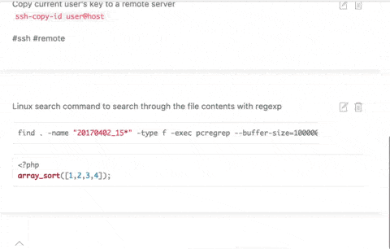

# ema-web-client
Web client to work with [EMA](https://github.com/lezhnev74/ema) backend

My goal was to make a fast, light and fat-free note editor. 
It is based on markdown and has fast search function.

## Based on packages

* https://getuikit.com
* https://github.com/NextStepWebs/simplemde-markdown-editor
* http://underscorejs.org/
* jQuery and https://github.com/Foliotek/ajaxq
 
## Installation

This app is written with PHP & JS code.
You need to setup this app on your server and fill out `.env` file (see also how to configure [server app](https://github.com/lezhnev74/ema)).
After that you can just open the app in your browser.
